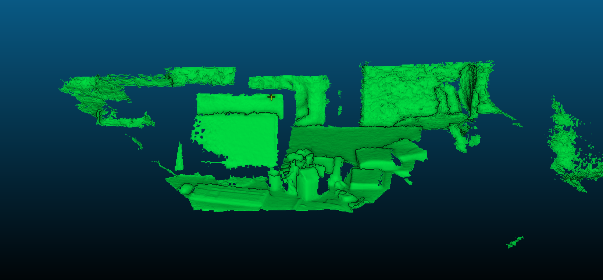
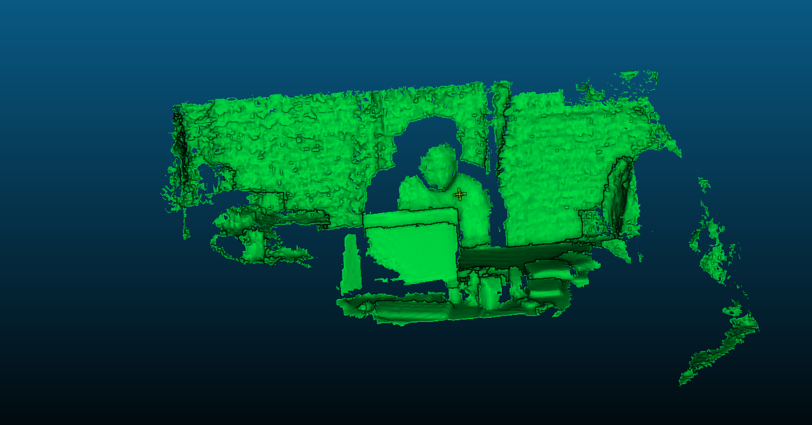

# KinectFusion-Cool-Edition
https://github.com/amroabuzer/KinectFusion-Cool-Edition
## Introduction
This is our implementation of [KinectFusion](https://www.microsoft.com/en-us/research/wp-content/uploads/2016/02/ismar2011.pdf) by Richard A. Newcombe et al. 
We aimed to parallelize all parts of the project, and so we make use of cuda for each part. We also aim to provide some CPU implementation at a later date. 

## Dependencies

- **Eigen3** 
- **FreeImage 3**
- **CUDA 12.2**
- (Optional) **Intel® RealSense™ SDK 2.0**

## Results




## Instructions
```
mkdir build && cd build
cmake ..
make
cd ..
./KinectFusionApp_Cuda
```

Make sure you create the additional outputs and  folder structure as follows:
```
┣ 📂src
┣ 📂build
┣ 📂data
┃ ┗ 📂rgbd_dataset_freiburg1_xyz
┃   ┗ 📂depth
┣ 📂outputs
┃ ┗ 📂point_clouds
┃ ┗ 📂meshes
```
## (Windows) Instructions

In order to run the code in Windows systems, use the `main_windows` branch. There you will find the CMakeLists.txt. it is necessary to compile with C++17 or higher. 

One should download a free version of `dirent.h` here: https://web.archive.org/web/20170428133315/http://www.softagalleria.net/dirent.php.  Dirent API is commonly available in UNIX systems but not all compilers in Windows provide it. 
